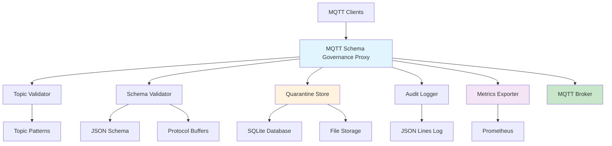

# MQTT Schema Governance Proxy

[](https://python.org)
[](LICENSE)
[](https://github.com/psf/black)
[](https://mypy.readthedocs.io/)
[](https://pytest.org/)
[](https://mqtt.org/)
[](https://json-schema.org/)
[](https://prometheus.io/)
[](#)
[](#)
[](#)
[](#)

> **A robust, production-ready MQTT message validation and governance proxy for IoT environments**

## 🚀 Overview

The MQTT Schema Governance Proxy is a powerful middleware solution that sits between MQTT clients and brokers to provide real-time message validation, schema governance, and compliance enforcement for IoT data streams. It ensures data quality, maintains schema compliance, and provides comprehensive monitoring and auditing capabilities.

## ✨ Key Features

### 🔍 **Message Validation**
- **Topic Pattern Matching**: Validate MQTT topics against configurable wildcard patterns
- **Schema Validation**: Support for JSON Schema and Protocol Buffers
- **Real-time Processing**: Low-latency message validation and forwarding
- **Custom Rules**: Flexible rule engine for complex validation scenarios

### 🛡️ **Data Governance**
- **Schema Evolution**: Manage schema versions and compatibility
- **Compliance Enforcement**: Ensure messages meet organizational standards
- **Message Quarantine**: Isolate invalid messages for review and analysis
- **Audit Trail**: Comprehensive logging of all validation decisions

### 📊 **Monitoring & Observability**
- **Prometheus Metrics**: Built-in metrics export for monitoring
- **Real-time Statistics**: Message throughput, validation rates, error metrics
- **Health Checks**: System health and performance monitoring
- **Grafana Dashboards**: Pre-built visualization templates

### 🔧 **Operations**
- **Zero-Downtime Deployment**: Hot configuration reloading
- **Horizontal Scaling**: Stateless design for easy scaling
- **Dry-Run Mode**: Test configurations without affecting production
- **CLI Management**: Command-line tools for administration

## 🏗️ Architecture



## 📋 Requirements

- **Python**: 3.8 or higher
- **Memory**: 512MB minimum, 2GB recommended
- **Storage**: 1GB for logs and quarantine data
- **Network**: Access to MQTT broker and monitoring systems

## 🚀 Quick Start

### 1. Installation

```bash
# Clone the repository
git clone https://github.com/yourusername/mqtt-schema-governance-proxy.git
cd mqtt-schema-governance-proxy

# Create virtual environment
python -m venv .venv
source .venv/bin/activate  # On Windows: .venv\Scripts\activate

# Install dependencies
pip install -r requirements.txt
```

### 2. Configuration

```bash
# Copy example configuration
cp config/rules.yaml.example config/rules.yaml

# Edit configuration for your environment
nano config/rules.yaml
```

### 3. Run the Proxy

```bash
# Development mode (dry-run)
python src/main.py --config config/rules.yaml --dry-run

# Production mode
python src/main.py --config config/rules.yaml --verbose
```

### 4. Verify Operation

```bash
# Check metrics endpoint
curl http://localhost:9100/metrics

# View quarantined messages
sqlite3 quarantine.sqlite3 "SELECT * FROM quarantined_messages LIMIT 5;"
```

## 📖 Documentation

| Document | Description |
|----------|-------------|
| [📋 Configuration Guide](docs/config_spec.md) | Complete configuration reference |
| [🏗️ Architecture](docs/architecture.md) | System architecture and design |
| [📚 Usage Guide](docs/usage.md) | Deployment and operation guide |
| [🔧 API Reference](docs/api.md) | REST API and metrics documentation |
| [🐛 Troubleshooting](docs/troubleshooting.md) | Common issues and solutions |

## ⚙️ Configuration Example

```yaml
# Topic patterns that are allowed
topic_patterns:
  - "sensor/+/temperature"
  - "device/+/status"
  - "events/#"

# Schema mappings
schema_mappings:
  "sensor/+/temperature": "temperature:v1"
  "device/+/status": "device_status:v1"

# Schema files
schema_files:
  "temperature:v1":
    file: "schemas/temperature_v1.json"
    format: "jsonschema"
```

## 📊 Monitoring

The proxy exposes Prometheus metrics on port 9100:

```
# Message throughput
mqtt_proxy_messages_total{status="valid"}
mqtt_proxy_messages_total{status="invalid"}

# Validation performance
mqtt_proxy_validation_duration_seconds
mqtt_proxy_quarantine_size_bytes

# System health
mqtt_proxy_uptime_seconds
mqtt_proxy_connection_status
```

## 🧪 Testing

```bash
# Run unit tests
pytest tests/ -v

# Run integration tests
pytest tests/test_proxy_flow.py -v

# Run functional tests
python functional_test.py

# Generate coverage report
pytest --cov=src tests/
```

## 🐳 Docker Deployment

```dockerfile
FROM python:3.11-slim

WORKDIR /app
COPY . .
RUN pip install -r requirements.txt

EXPOSE 1884 9100
CMD ["python", "src/main.py", "--config", "config/rules.yaml"]
```

```bash
# Build and run
docker build -t mqtt-schema-proxy .
docker run -p 1884:1884 -p 9100:9100 mqtt-schema-proxy
```

## 🔧 Development

### Setup Development Environment

```bash
# Install development dependencies
pip install -r requirements-dev.txt

# Install pre-commit hooks
pre-commit install

# Run linting
black src/ tests/
mypy src/
flake8 src/ tests/
```

### Project Structure

```
mqtt-schema-governance-proxy/
├── src/                    # Source code
│   ├── main.py            # Application entry point
│   ├── mqtt_proxy.py      # Core proxy logic
│   ├── schema_validator.py # Schema validation
│   └── ...
├── config/                # Configuration files
├── schemas/               # Schema definitions
├── tests/                 # Test suite
├── docs/                  # Documentation
└── scripts/               # Utility scripts
```

## 🤝 Contributing

We welcome contributions! Please see our [Contributing Guide](CONTRIBUTING.md) for details.

1. Fork the repository
2. Create a feature branch (`git checkout -b feature/amazing-feature`)
3. Commit your changes (`git commit -m 'Add amazing feature'`)
4. Push to the branch (`git push origin feature/amazing-feature`)
5. Open a Pull Request

## 📝 License

This project is licensed under the MIT License - see the [LICENSE](LICENSE) file for details.

## 🌟 Acknowledgments

- Built with [paho-mqtt](https://github.com/eclipse/paho.mqtt.python) for MQTT connectivity
- Uses [jsonschema](https://github.com/python-jsonschema/jsonschema) for JSON Schema validation
- Monitoring powered by [Prometheus](https://prometheus.io/)
- Documentation built with [MkDocs](https://www.mkdocs.org/)

## 📈 Roadmap

- [ ] **v2.0**: WebUI for configuration and monitoring
- [ ] **v2.1**: Support for Apache Avro schemas
- [ ] **v2.2**: Advanced routing and transformation
- [ ] **v2.3**: Machine learning-based anomaly detection
- [ ] **v3.0**: Multi-tenant support and API gateway features

---

<div align="center">

**[⭐ Star this repo](https://github.com/yourusername/mqtt-schema-governance-proxy)** if you find it useful!

Made with ❤️ for the IoT community

</div>
