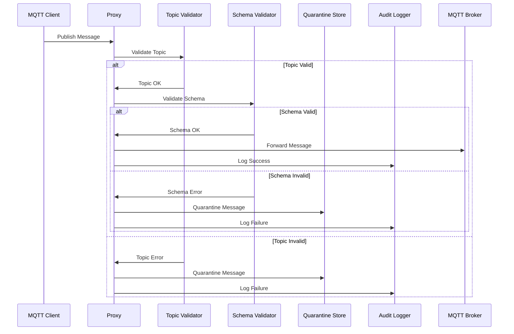
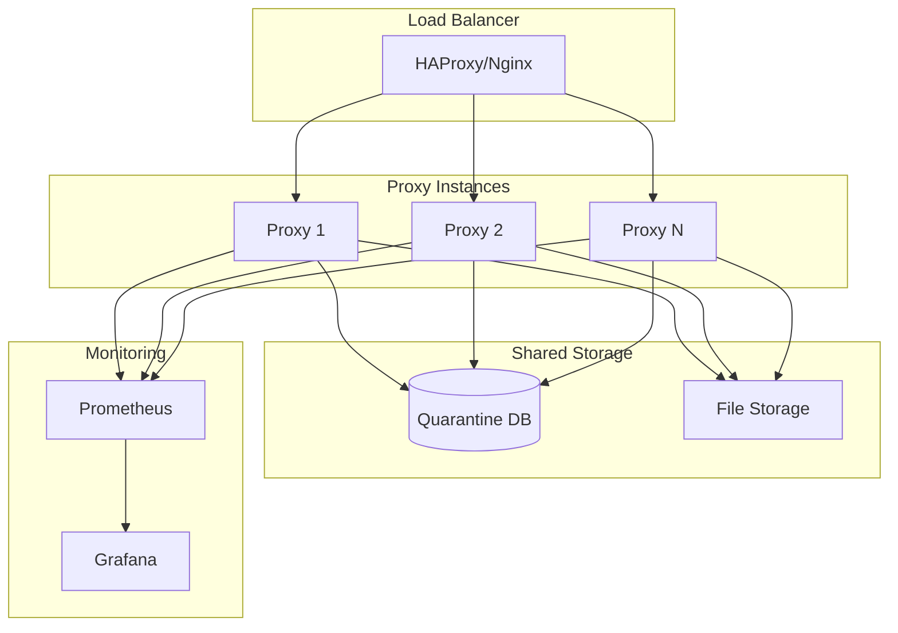

# MQTT Schema Governance Proxy - Architecture

[](#)
[](#)
[](#)

## 🏗️ System Architecture Overview

The MQTT Schema Governance Proxy implements a modular, event-driven architecture designed for high-throughput IoT message processing with robust validation and governance capabilities.

## 📋 Architecture Principles

### **Separation of Concerns**
- Each component handles a specific responsibility
- Loose coupling between modules
- High cohesion within modules

### **Stateless Design**
- Components don't maintain session state
- Enables horizontal scaling
- Simplifies deployment and recovery

### **Event-Driven Processing**
- Asynchronous message processing
- Non-blocking I/O operations
- Reactive programming patterns

### **Observability First**
- Built-in metrics and logging
- Health check endpoints
- Distributed tracing support

## 🔧 Core Components

### 1. **MQTT Proxy Core** (`mqtt_proxy.py`)

```python
class MQTTProxy:
    """
    Central orchestrator that manages message flow between 
    subscribers, validators, and publishers.
    """
```

**Responsibilities:**
- MQTT connection management (subscriber/publisher)
- Message routing and orchestration
- Error handling and recovery
- Connection pooling and load balancing

**Key Features:**
- Dual connection model (subscriber + publisher)
- Graceful degradation on broker failures
- Message buffering and retry logic
- Configurable timeouts and backoff

### 2. **Topic Validator** (`topic_validator.py`)

```python
class TopicValidator:
    """
    Validates MQTT topics against configured patterns
    using MQTT-standard wildcards (+ and #).
    """
```

**Responsibilities:**
- Topic pattern matching
- MQTT wildcard support (`+`, `#`)
- Client-specific rule application
- Pattern syntax validation

**Algorithm:**
- O(n) pattern matching with early termination
- Compiled regex caching for performance
- Longest-prefix matching for client rules

### 3. **Schema Validator** (`schema_validator.py`)

```python
class SchemaValidator:
    """
    Multi-format schema validation engine supporting
    JSON Schema and Protocol Buffers.
    """
```

**Responsibilities:**
- JSON Schema validation (Draft 7)
- Protocol Buffers support
- Schema caching and compilation
- Error aggregation and reporting

**Supported Formats:**
- **JSON Schema**: Full Draft 7 specification
- **Protocol Buffers**: Binary format validation
- **Extensible**: Plugin architecture for new formats

### 4. **Quarantine Store** (`quarantine_store.py`)

```python
class QuarantineStore:
    """
    Persistent storage for invalid messages with
    rich metadata and search capabilities.
    """
```

**Responsibilities:**
- SQLite-based message persistence
- File-based payload storage
- Search and analytics
- Retention policy enforcement

**Storage Strategy:**
- **Metadata**: SQLite for structured queries
- **Payloads**: File system for large data
- **Indexing**: Optimized for time-series queries

### 5. **Configuration Loader** (`config_loader.py`)

```python
class ProxyConfig:
    """
    Type-safe configuration management with
    validation and hot-reloading support.
    """
```

**Responsibilities:**
- YAML configuration parsing
- Schema validation for config files
- Path resolution and normalization
- Configuration change detection

### 6. **Metrics Exporter** (`metrics_exporter.py`)

```python
class MetricsExporter:
    """
    Prometheus-compatible metrics collection
    and HTTP endpoint exposure.
    """
```

**Responsibilities:**
- Metrics collection and aggregation
- Prometheus format export
- Health check endpoints
- Performance monitoring

### 7. **Audit Logger** (`audit_logger.py`)

```python
class AuditLogger:
    """
    Structured logging for compliance and
    security auditing requirements.
    """
```

**Responsibilities:**
- JSON-structured log output
- Audit trail maintenance
- Log rotation and archival
- Security event tracking

## 🔄 Message Processing Flow



## 📊 Data Flow Architecture

### **Input Processing**
1. **Connection Handling**: Maintain persistent MQTT connections
2. **Message Reception**: Async message handling with backpressure
3. **Parsing**: Topic and payload extraction
4. **Routing**: Direct to validation pipeline

### **Validation Pipeline**
1. **Topic Validation**: Pattern matching against allowed topics
2. **Schema Mapping**: Topic pattern → Schema identifier resolution
3. **Schema Validation**: Payload validation against schema
4. **Decision**: Forward or quarantine based on validation results

### **Output Processing**
1. **Valid Messages**: Forward to upstream broker
2. **Invalid Messages**: Store in quarantine with metadata
3. **Audit Events**: Log all processing decisions
4. **Metrics**: Update performance counters

## 🔐 Security Architecture

### **Authentication & Authorization**
- MQTT client certificate validation
- Topic-based access control
- Schema-based data governance
- Audit trail for compliance

### **Data Protection**
- TLS/SSL encryption for MQTT connections
- Secure credential storage
- Message payload encryption support
- PII data masking capabilities

### **Network Security**
- Network segmentation support
- Firewall-friendly design
- DDoS protection through rate limiting
- Intrusion detection integration

## 📈 Scalability Design

### **Horizontal Scaling**


### **Performance Characteristics**
- **Throughput**: 10,000+ messages/second per instance
- **Latency**: <5ms validation latency (P99)
- **Memory**: Constant memory usage with LRU caches
- **CPU**: Scales linearly with message volume

### **Resource Requirements**
| Component | CPU | Memory | Storage | Network |
|-----------|-----|--------|---------|---------|
| Proxy Instance | 1-2 cores | 1-2 GB | 100 MB | 100 Mbps |
| Quarantine Store | 0.5 cores | 512 MB | 10-100 GB | 10 Mbps |
| Metrics Export | 0.1 cores | 128 MB | 1 GB | 10 Mbps |

## 🔧 Configuration Architecture

### **Configuration Hierarchy**
```yaml
# Global settings
global:
  proxy_mode: "production"
  log_level: "INFO"

# Broker connections
brokers:
  upstream:
    host: "mqtt.example.com"
    port: 8883
    ssl: true

# Validation rules
validation:
  topic_patterns: [...]
  schema_mappings: {...}
  schema_files: {...}

# Storage configuration
storage:
  quarantine:
    driver: "sqlite"
    path: "quarantine.db"
  
# Monitoring setup
monitoring:
  metrics:
    enabled: true
    port: 9100
```

### **Hot Configuration Reloading**
- File system watching for config changes
- Graceful schema updates without restarts
- Validation rollback on invalid configs
- Zero-downtime reconfiguration

## 🚀 Deployment Patterns

### **Development**
```bash
# Single instance with local storage
python src/main.py --config config/dev.yaml --dry-run
```

### **Production**
```bash
# Multi-instance with shared storage
docker-compose up --scale proxy=3
```

### **Cloud Native**
```yaml
# Kubernetes deployment with auto-scaling
apiVersion: apps/v1
kind: Deployment
metadata:
  name: mqtt-proxy
spec:
  replicas: 3
  selector:
    matchLabels:
      app: mqtt-proxy
  template:
    spec:
      containers:
      - name: proxy
        image: mqtt-proxy:latest
        resources:
          requests:
            memory: "512Mi"
            cpu: "250m"
          limits:
            memory: "1Gi"
            cpu: "500m"
```

## 🔍 Monitoring & Observability

### **Metrics Collection**
- **Business Metrics**: Message counts, validation rates
- **Technical Metrics**: Latency, error rates, resource usage
- **Infrastructure Metrics**: Network, storage, system health

### **Alerting Strategy**
- **Critical**: Service unavailable, data loss
- **Warning**: High error rates, performance degradation
- **Info**: Configuration changes, scheduled maintenance

### **Logging Architecture**
- **Structured Logging**: JSON format for machine processing
- **Log Levels**: DEBUG, INFO, WARNING, ERROR, CRITICAL
- **Log Aggregation**: ELK stack or similar for centralized logging

## 🔄 Error Handling & Recovery

### **Failure Modes & Recovery**
| Failure Type | Detection | Recovery Strategy |
|--------------|-----------|-------------------|
| MQTT Broker Down | Connection timeout | Retry with exponential backoff |
| Schema File Missing | File not found | Use cached version, alert admin |
| Database Unavailable | SQLite error | Queue in memory, retry writes |
| Memory Exhaustion | Resource monitoring | Shed load, restart instance |

### **Circuit Breaker Pattern**
- Fail-fast on downstream service failures
- Configurable failure thresholds
- Automatic recovery detection
- Graceful degradation modes

---

This architecture provides a solid foundation for enterprise-grade MQTT message governance while maintaining flexibility for future enhancements and scaling requirements.
